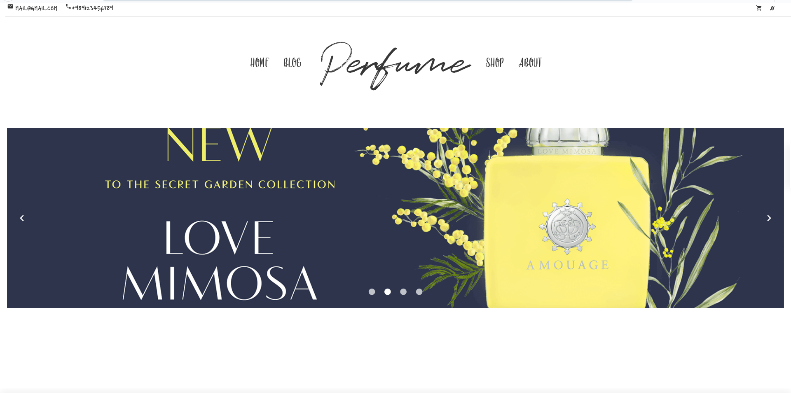
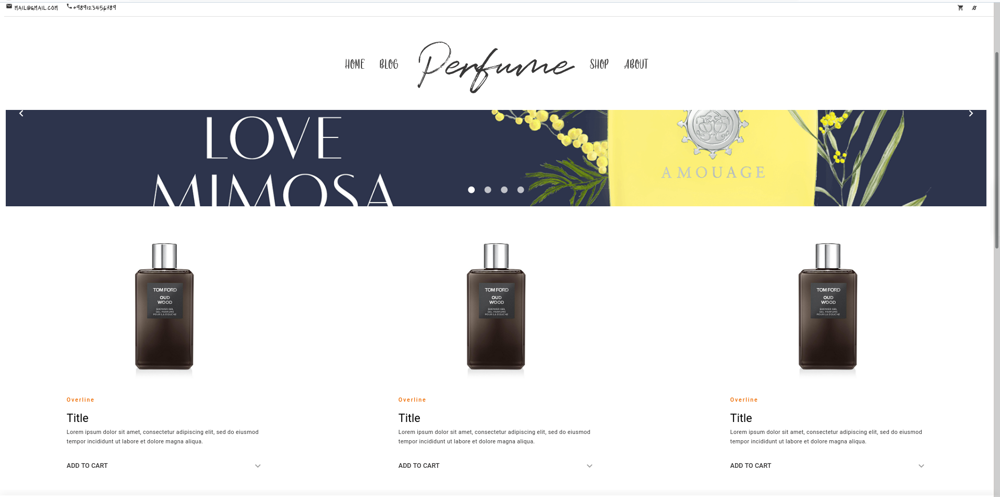
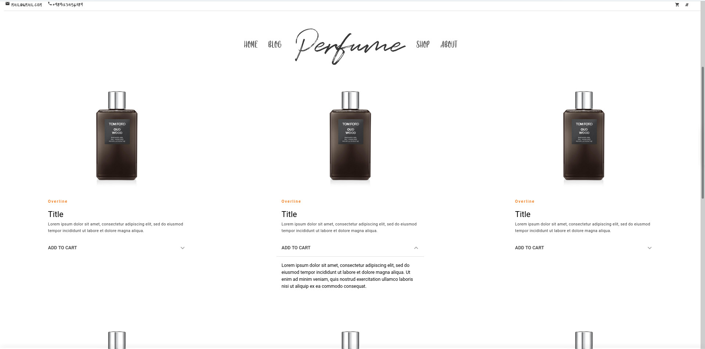

# Perfume-shop-template
A perfume shop template using quasar and vue js


## Install the dependencies
```bash
yarn
```

### Start the app in development mode (hot-code reloading, error reporting, etc.)
```bash
quasar dev
```


### Build the app for production
```bash
quasar build
```

### Customize the configuration
See [Configuring quasar.conf.js](https://quasar.dev/quasar-cli/quasar-conf-js).


# Template Screenshots 

### Header


### Items


### Items_expanded

